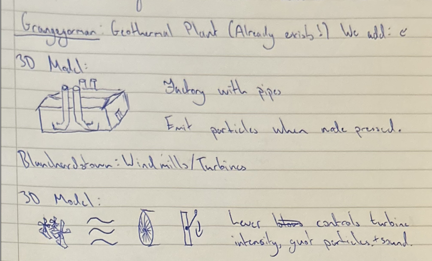
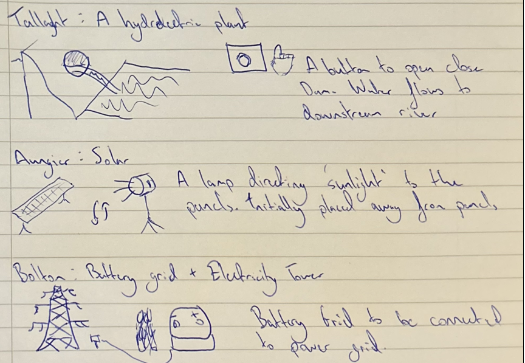
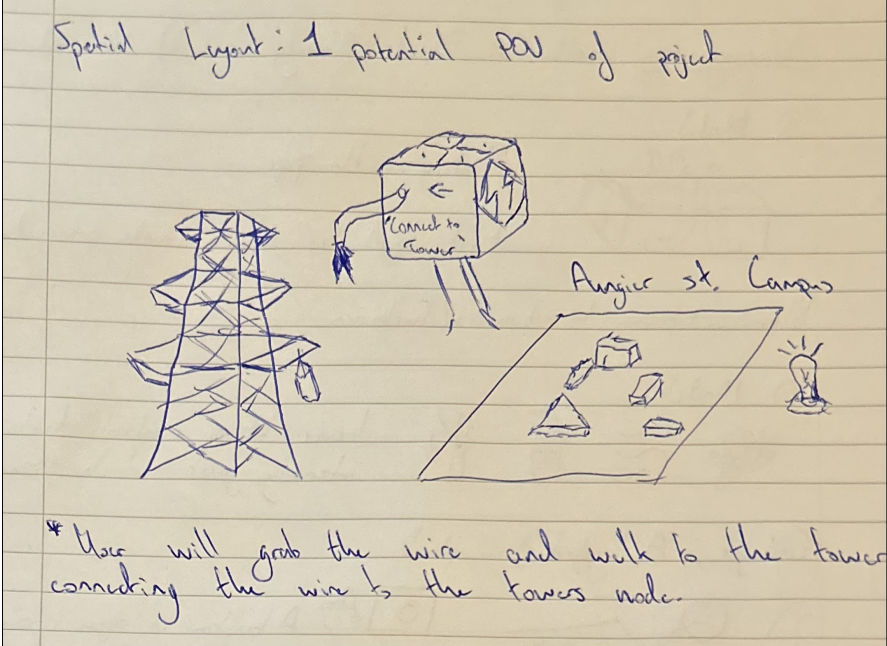

# Powering TU Dublin: SDG 7: Affordable & Clean Energy
| Name | Student Number |
|-----------|-----------|
| *Noel McCarthy* | *C22533826* |

## Project Proposal & Overview

**Powering TU Dublin** is an interactive XR extension of the [Quest:SDG](https://github.com/skooter500/questsdg) project. The project aims to transform the SDG7 Cube into a tactile learning experience, allowing users to physically explore and setup renewable energy sources to power the TU Dublin campuses. 
I picked SDG7 as I wanted to visualise the infrastructure behind different types of renewable energy sources, and how each campus aligns with a different type of energy source. 

When the **SDG 7 cube** is selected, five renewable energy installations appear around the campuses each requiring setup. 
There will be a guide on what to do for each site, alongside information related to that source of energy.
Every activation triggers visuals and audio:

| Campus | Renewable Energy | Description | Feedback |
|---------|------------------|--------------|-----------|
| **Grangegorman** | 🌡️ **Geothermal** | Grangegorman is home to the GEMINI geothermal borehole project. | Press a heat pump node; orange thermal light rises from vents. A soft ambient heatwave effect radiates from the campus. |
| **Blanchardstown** | 🌬️ **Wind Energy** | Situated on the outskirts of Dublin, with open surroundings suitable for wind farms. | User interacts with a lever, the further it is moved the more intense wind turbine blades spin with gust particle effects. A whooshing wind sound plays as Blanchardstown glows with a blue hue. |
| **Tallaght** | 💧 **Hydroelectric/Water Energy** | Near the foothills of the Dublin mountains we can link water and rivers. | Press a button; a dam opens up with ripple particles and water sounds. Tallaght glows cyan-blue. |
| **Aungier Street** | ☀️ **Solar Energy** | City center based campus, limited on space but so take advantage of roof space. | User “aims sunlight” beam toward solar panels. Panels glow golden, and a soft solar hum plays as campus lights up. |
| **Bolton Street** | 🔋 **Energy Storage/Electric Grid** | Engineering campus, symbol of energy efficiency and innovation. | An electricity tower stands and the user must connect it to a battery bank to power lights around the campus. Electric sparks shoot from tower, batteries glow. |

---

## Key Features & Interactions
- **Core Interaction:** walk to each renewable installation → interact with energy source -> distinct **visual/audio feedback** per energy source.  
- **Dynamic lighting** to illuminate linked campuses.  
- **Resettable scene** for repeat demonstrations.  

---

## XR Technologies
- **Hand Tracking 2.0** for tactile button activation.  
- **Passthrough AR** (Quest 3) for blending virtual and real spaces.  
- **Spatial Audio** for local feedback (wind, water, solar hum).  
- **Particle Systems** for wind gusts, sunlight beams, and water ripples.  
- **Dynamic Lighting** for campus illumination.  

---

## Sketches 
Here I have 6 sketches, 5 of what I expect to develop for energy source installations, and 1 example of the spatial layout including the interaction. very rudimentary and the expected interactions. 

Grangegorman & Blanchardstown

Tallaght, Aungier st, & Bolton St

Spatial example, this is how i expect the models to exist in godot. Each installation will be located next to the campus, meaning the user needs to walk over, and then interact with it. 

